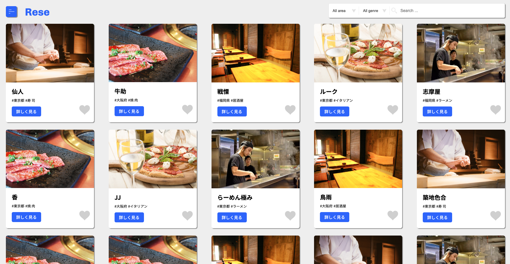
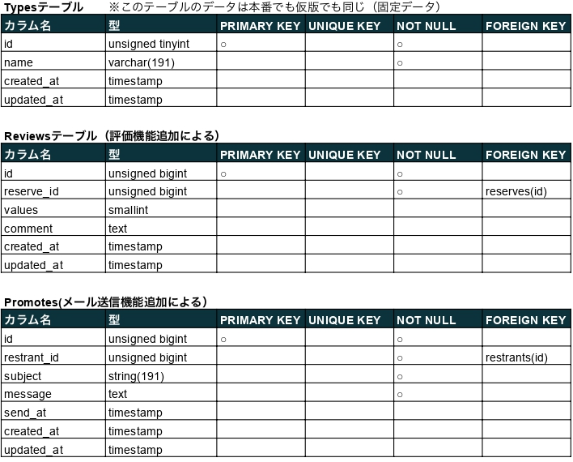
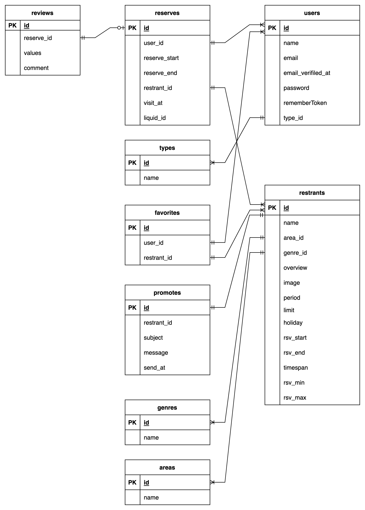

# Rese（リーズ）

Rese 社のグループ会社の飲食店予約サービス

## 作成した目的

外部の飲食店予約サービスは手数料の支払いが発生するため、自社で予約サービスを持ちたい。

## URL

https://github.com/yskabye/20221206ooki.git

## 機能一覧

-   会員登録
-   ログイン
-   ログアウト
-   ユーザー情報取得
-   ユーザー飲食店お気に入り一覧取得
-   ユーザー飲食店予約情報取得
-   飲食店一覧取得
-   飲食店詳細取得
-   飲食店お気に入り追加
-   飲食店お気に入り削除
-   飲食店予約情報追加
-   飲食店予約情報削除
-   飲食店予約情報変更
-   エリアで検索
-   ジャンルで検索
-   店名で検索
-   利用後評価
-   予約に対する QR コードを表示
    (以下は管理者向け)
-   店舗管理者追加
-   店舗管理者編集
-   店舗管理者削除
-   新規店舗追加
    (以下は店舗管理者向け)
-   店舗情報を編集
-   店舗画像を変更
-   予約一覧表示
-   予約一覧を日付、または時刻で絞って表示
-   メールマガジン入力・送信
-   予約者チェックインのQRコードにて確認

## 使用技術

-   Laravel 8.83.26(Framework, PHP 7.4)
-   jQuery(3.5.1)
-   jsQR
-   Simple QrCode(v4)

## テーブル設計

** 1](images/fa70a6413294c677d9fa10f6ddfda4bf8803e4f24a00ec7fe8c7515bcf4d87bd.png)  

##　 ER 図

  

## 環境構築

-   CLI を開き、展開先フォルダーの親フォルダー下にあるものとします。
-   'composer create-project "laravel/laravel=8.\*" (展開先フォルダ名) --prefer-dist"を実行します。(composer は予めインストール済みとしています。)
-   "展開先フォルダ名"へ移動して、 'composer require "laravel/breeze=1.9.0" --dev'と入力して実行します。
-   "php artisan breeze:install"と入力して実行します。
-   "npm install && npm run dev"と入力して実行します。(npm はインストール済みとしています。)
-   "composer require simplesoftwareio/simple-qrcode"と入力して実行します。
-   以下のコマンドで本コードを現在の場所に上書きします。
    -   git init
    -   git remote add origin https://github.com/yskabye/20221206ooki.git
    -   git fetch origin main
    -   git reset --hard origin/main
-   Web のルートフォルダーが展開先の”public"フォルダー下となるようにウェブサーバーを設定します。変更したらば、再起動します。
-   ".env"ファイルについては、以下の変更が必要です。
    -   用意された DB サーバーと SMTP サーバーに合わせて設定してください。
    -   プロジェクト名は"rese"に変更して下さい。発送されるメールに反映されます。
    -   "QUEUE_CONNECTION"を"database"に変更して下さい。
-   public 下に、"../storage/app/public"をターゲットとした"storage"のシンボリックファイルを作成して下さい。使用しているマシンがUnix/Linuxの場合はターミナルからは以下のようなコマンドで行います。

    UNIX,mac OS の場合 : ln -s ../storage/app/public storage

    なお、上記のコマンドは環境により管理者モードで実行して下さい。

-   "php artisan migrate"でテーブルを作成します。
-   "php artisan db:seed"でデータを挿入します。

    ※現在、設定されている内容は本番用になります。テスト用データを利用する場合はコメントを解除して下さい。

## 特記事項

-   アカウントは利用者とサイト管理者、店舗管理者の３種類
-   サイト管理者用のアドレスはLaravelの機能を使って直接登録する。
-   利用者は登録画面から利用者自身が登録できるが、店舗管理者はサイト管理者が登録できる。
-   利用者は確認メールによる認証が必要だが、サイト管理者・店舗管理者は不要。
-   利用者が予約の変更する場合、予約一覧の時計アイコンをクリックすると変更画面に遷移する。
-   利用者が店舗の評価を行う場合は"History"(予約履歴)画面にて可能。
-   店舗管理者は管理している店舗の概要、店舗イメージ画像、運用日時等の設定ができる。
-   店舗画像の縦横比は概ね3:2となっているものを対象として下さい。
-   新規店舗が発生した場合は、サイト管理者にて追加し、担当となった店舗管理者が具体的な情報を設定する。
-   QRコードの認識は印刷されたものでも可能。
-   QRコード認証用のカメラはQRコード専用カメラではなく、通常のWebカメラで行います。

